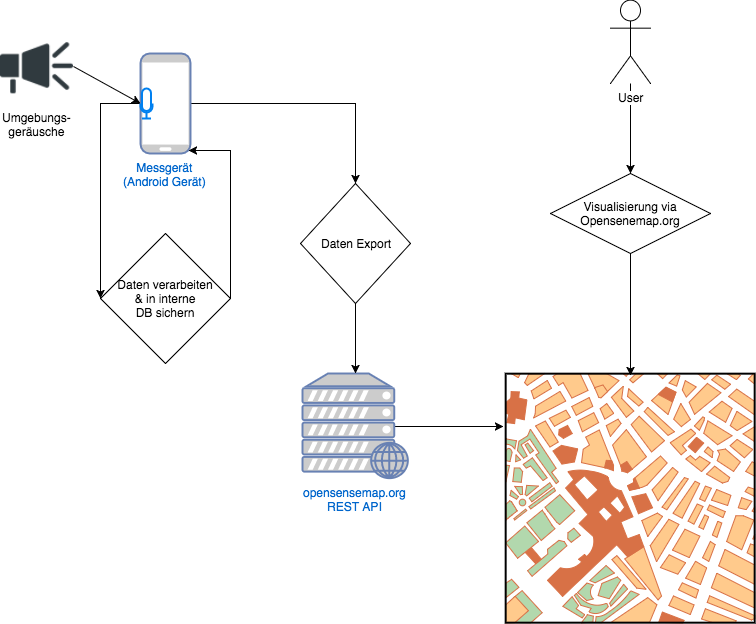
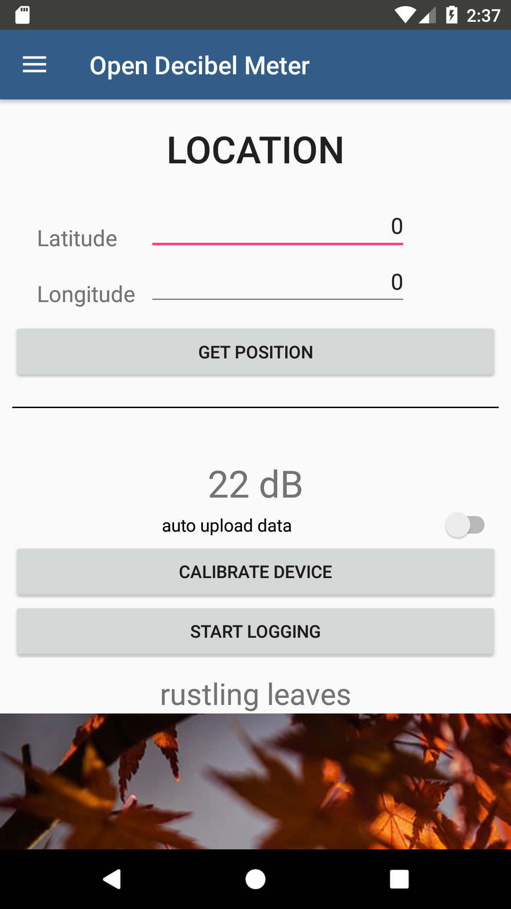
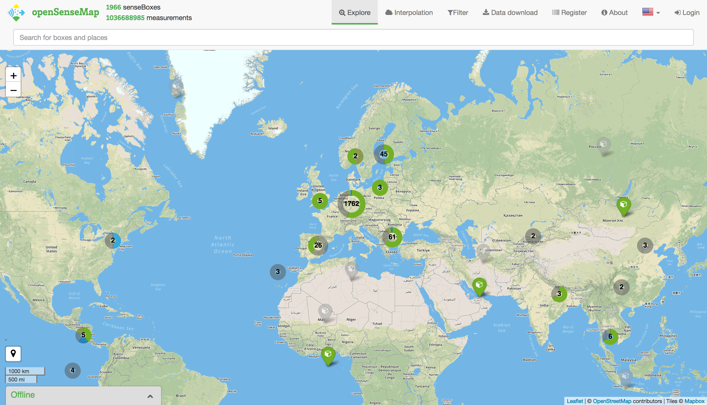
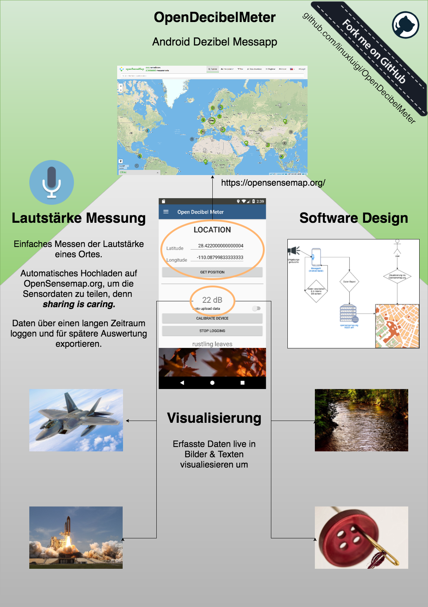

Einleitung
==========

Idee
----

Eine Android App zu entwickeln die mittels des eingebauten Micophones die Umgebungslautstärke in Dezibel misst.

Diese gesammelten Daten sollen in einer internen SQL Datenbank in ein Minuten Intervall gesichert werden, zusätzlich zu
den Dezibel Wert soll auch die genaue Zeit & GPS Standort enthalten sein.
Die Daten sollen anschließend in Dateiformat exportierbar sein, sodass andere Anwendungen darauf zugreifen können.
Außerdem zur Visualisierung, sollen die Daten auch auf https://opensensemap.org/ hochgeladen werden können.
Um die Daten auf https://opensensemap.org/ zu exportieren wird die Öffentliche API des Anbieters angesprochen:
https://docs.opensensemap.org/

.. index:: Idee

Umgesetzt wurde
---------------

Eine Android App die die Amplituden auschläge von den internen Micophonen misst, diese umrechnet in ein Dezibel Wert (db)
und in der internen SQLite Datenbank speichert und live zur https://opensensemap.org/ mittels der REST API hochlädt. Außerdem
ist es möglich die gemessenden Werte in einer csv Datei zu exportieren.

Die App alle 200 Millisekunden und berechnet aus 600 Messdaten ein Durchschnitt, welcher in der SQLite Datenbank gesichert
wird & auf opensensemap pupliziert wird.

    Software Design

.. index:: Software Design

UI Elemente:
^^^^^^^^^^^^

- Login Form zur Opensensemap
- User Profile für Opensensemap
- Messbereich mit vergleichs Visualesierung der Lautstärke
- Simple grafische Auswertung der Messwerte
- Listenansicht aller gesicherten Werte mit löschfunktion

.. index:: UI Elemente

Integrierte Sprachen:
^^^^^^^^^^^^^^^^^^^^^

- Englisch
- Deutsch

.. index:: Sprachen

Android App
^^^^^^^^^^^

Die Android App wurde mittels Android Studio 3.1.2 erstellt.

- Quellcode : https://github.com/linuxluigi/OpenDecibelMeter

.. index:: Git
.. index:: Quellcode

    App Screenshot - Messbereich

.. _opensensemap:

Opensensemap
^^^^^^^^^^^^

Mittels https://opensensemap.org/ werden die gemessenden Daten visualesiert. Opensenemap ist ein OpenSource Projekt welches
als Plattform für Sensordaten dient, es ist möglich eigene Sensordaten auf Opensensemap zu posten.

- Website URL: https://opensensemap.org/
- Quellcode : https://github.com/sensebox/openSenseMap

.. index:: Opensensemap

Dokumentation
^^^^^^^^^^^^^

Die Dokumentation wurde mit Sphinx :cite:`SphinxHomepage` erstellt und gehostet auf `readthedocs.io`_  und `github.com`_.

.. _readthedocs.io: https://readthedocs.io/
.. _github.com: https://github.com/

- Quellcode : https://github.com/linuxluigi/OpenDecibelMeter
- Online Dokumentation: http://opendecibelmeter.readthedocs.io/de/latest/

.. index:: Git
.. index:: Quellcode
.. index:: Online Dokumentation

Poster
^^^^^^

Das Poster wurde mit https://www.draw.io/ erstellt und ist auf `github.com`_ als PNG & XML gehostst.

.. _github.com: https://github.com/

- Poster XML : `Poster.xml`_
- Poster PNG : `Poster.png`_

.. _Poster.xml: _static/Poster.xml
.. _Poster.png: _static/Poster.png

.. index:: LibreOffice
.. index:: Präsentation

    OpenDecibelMeter - Poster