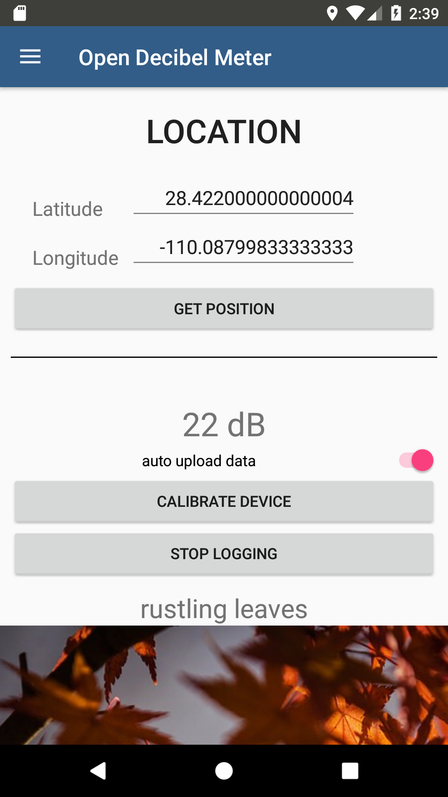

.. _quickstart:

Quickstart
==========

.. _permission:

Permission
----------

Damit die Fehlerfrei funktioniert müssen alle Rechte der App aktiviert werden, dazu muss in Android über
``Settings -> App -> OpenDecibelMeter -> Permissions`` alle switches aktiviert werden.

    App Screenshot - App-Info

    App Screenshot - App-Rechte

.. _microphone:

Microphone
----------

Da jedes Android Gerät unterschiedliche verbaute Microphone verwendet unterscheiden sich die gemessenden Werte von
Gerät zu Gerät. Um dies bestmöglich aus zu gleichen ist es nötig das Gerät zu Kalibrieren, dazu muss in den Messbereich
auf ``Gerät einstellen`` oder ``Calibrate Device`` geklickt werden.

.. figure:: _static/app_start_01.png
    :alt: App Screenshot - Messbereich
    :align: center
    :scale: 10%

    App Screenshot - Messbereich

Darauf erscheint ein weiterer Bereich wo sich ein Eingabetextfeld & ein Switch sich befindet, nach aktivieren des Switches
wird die aktuelle Amplitude des Micophones gemessen, dies sollte an einen Ort getätigt werden, wo keine Geräusche sind.

Es ist auch möglich die Amplitude Manuell ein zu stellen, dafür muss auf der Zahl geklickt werden.

.. figure:: _static/app_start_03.png
    :alt: App Screenshot - Kalibrieren
    :align: center
    :scale: 10%

    App Screenshot - Kalibrieren

Nachdem die Amplitude eingestellt wurde, muss auf ``Sichere Amplitude`` bzw. ``save Amplitude`` geklickt werden.

.. _position_bestimmung:

Position bestimmen
------------------

Um die letzte bekannte Position des Gerätes automatisch zu orten muss nur auf ``Lade Position`` bzw. ``get position`` geklickt
werden.

.. figure:: _static/app_start_02.png
    :alt: App Screenshot - Positionsbestimmung
    :align: center
    :scale: 10%

    App Screenshot - Positionsbestimmung

Die Positions Koordinaten werden nur für den Upload in Opensensemap benötigt, wenn dies nicht erwünscht ist, muss die Position
0, 0 angeben werden.

.. index:: Opensensemap

.. _upload_data:

Upload der Daten auf Opensensemap
---------------------------------

Neue senseBox auf Opensensemap erstellen
^^^^^^^^^^^^^^^^^^^^^^^^^^^^^^^^^^^^^^^^

Um Daten auf Opensensemap.org hoch zu laden, wird ein Account benötigt. Dieser kann auf https://opensensemap.org/ erstellt werden

    Opensensemap - login

Nach der Registration muss eine neue SenseBox erstellt werden, dafür auf opensensemap einloggen und oben rechts auf das
User Profil Icon klicken & im dropdown menu ``New senseBox`` auswählen.

.. figure:: _static/OpenSenseMap_03.png
    :alt: Opensensemap - erstelle neue senseBox
    :align: center
    :scale: 40%

    Opensensemap - erstelle neue senseBox

Im **General** Bereich die pflicht Felder ausfüllen "Name of your station*" & bei "Exposure*" **Mobile** auswählen. Die
**Location** wird später vom Gerät bestimmt und muss somit nicht manuell angegeben werden.

    Opensensemap - Einstellungen: General

Unter **Hardware** "Manual configuration" auswählen und ein Sensor mit folgenden Eigenschaften erstellen. Anschließend auf
**Next** klicken und auf der nächsten seite die neue **senseBox** bestätigen.

- **Icon:** Lautsprecher
- **Phenomenon:** decibel
- **Unit:** db
- **Type:** db

    Opensensemap - Einstellungen: Hardware

    Opensensemap - Einstellungen: Bestätigen

In App Login
^^^^^^^^^^^^

Um sich in der App ein zu loggen muss oben links auf den Menu Button (Hamburger) geklickt werden und anschließend auf Login.

    App - Navigation zum login

Anschließend muss nur noch seine zuvor erstellen nuzterdaten von Opensensemap eingeben werden und auf den Login Button klicken.

    App - Login

Wenn der login erfolgreich war, sieht man sein Opensensemap Account mit ein Gravatar Bild in der Navigationsleiste.

    App - Navigation mit eingeloggten Konto

Als nächstes muss in Navigationsbereich ``Profile`` ausgewählt werden und dort im Dropdown bereich seine ``sensorBox`` im
Dropdown auswählen.

**WICHTIG**
    Auch wenn nur eine ``sensorBox`` im Opensensemap Konto eingetragen wurde, muss diese erst noch ausgewählt werden,
    wenn keine ``sensorBox`` ausgewählt wird, werden keine Daten hochgeladen!!!

    App - Profile

Datenerfassen und hochladen
^^^^^^^^^^^^^^^^^^^^^^^^^^^

Zum Datenerfassen und live hochladen zu Opensensemap muss ein Account von Opensensemap in der App eingeloggt sein und im
Messbereich ``auto upload data`` aktiviert werden. Optional kann :ref:`position_bestimmung` verwendet werden um seine aktuelle
Position automatisch mit dem Dezibel Wert auf Opensensemap zu posten.

Anschließend nur noch auf ``start loggin`` klicken und die Daten werden in einer localen SQLite Datenbank auf dem Gerät
gesichert und ca alle 2 Minuten auf Opensensmap hochgeladen.

    App - Messbereich mit auto upload

Ausgaben der Daten auf dem Gerät
--------------------------------

Listenansicht
^^^^^^^^^^^^^

Die Listenansicht mit Löschfunktion (nach links oder rechts wischen) befindet sich im Menü unter ``Log``.

    App - Listenansicht

Graphenansicht
^^^^^^^^^^^^^^

Die Graphenansicht befindet sich im Menü unter ``Graph``.

    App - Graphenansicht

